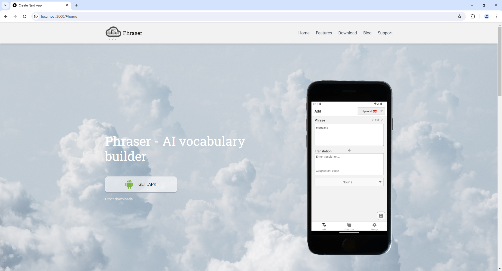

# Phraser website
__Description:__ Website for the Phraser app

__Deployed project:__ http://phraser365.com

__Used technologies:__

- Typescript
- React
- Next.js (app router)
- Tailwind
- Adaptive-responsive design
- Flex layout

 

__About project:__ Website for the Phraser mobile app. Includes brief info about the app, blog, user guide and other support articles. Written on Next.js

## Preview
